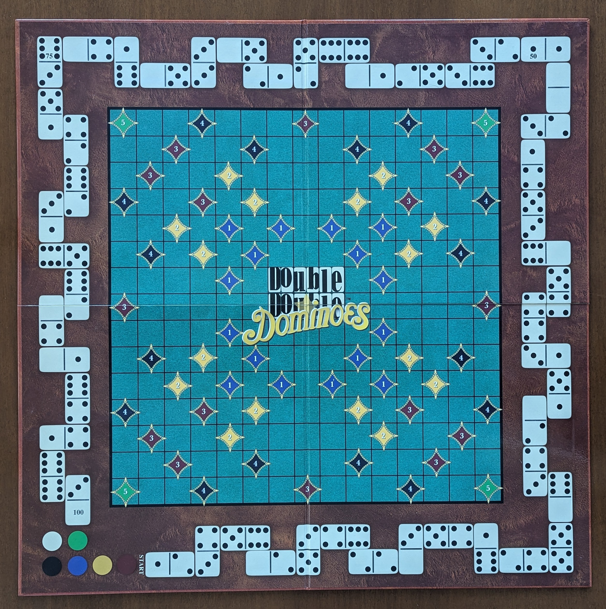

## Double Double Dominoes - Game Description
DDD combines elements from Scrabble and traditional dominoes. Players build chains of domino pieces to cover special squares on the board and earn points. The goal is to get the highest score by placing dominoes strategically on the game board. For more details on the rules and gameplay, you can watch this [video tutorial](https://www.youtube.com/watch?v=ORPJIjFkluQ&t).

  

### Game Board

The DDD board features a 15x15 grid with a mix of simple squares and special squares marked by colored diamonds, which offer bonus points. Similar to Scrabble, covering these special squares grants additional points:
- **Blue Diamonds**: 1 point 
- **Yellow Diamonds**: 2 points
- **Brown Diamonds**: 3 points
- **Black Diamonds**: 4 points
- **Green Diamonds**: 5 points

In addition to the grid, the board has an external scoring path that runs along its border. Players move their score markers along this path as they earn points. Bonus points are awarded when a domino’s value matches the number on the square where the player’s marker is located.

### Domino Tiles
A domino tile has two ends, each with a value from 0 to 6, represented by black dots. There are 28 unique domino tiles in total. In DDD, each tile appears twice, meaning there are 56 tiles altogether. Players start by drawing 3 dominoes from a bag and continue drawing as they play.

### Game Flow
1. The game begins with a player placing a tile on the central square (marked with a star ★).
2. Each following tile must connect to an existing tile by matching one of its values.
3. When a player places a double tile (e.g. 1-1), they get an extra turn.
4. Players earn points by covering special squares or by matching the number on the tile with the number on their pawn’s square on the scoring track.

### Scoring Rules
Players can earn points in two main ways:
- **Covering Special Squares**: If a tile is placed on a special square, the player earns the points assigned to that square. If the tile is a double, the points are doubled.
- **Matching the Scoring Track**: If a tile’s number matches the number on the scoring track where a player's pawn is located, they receive 3 extra points.
