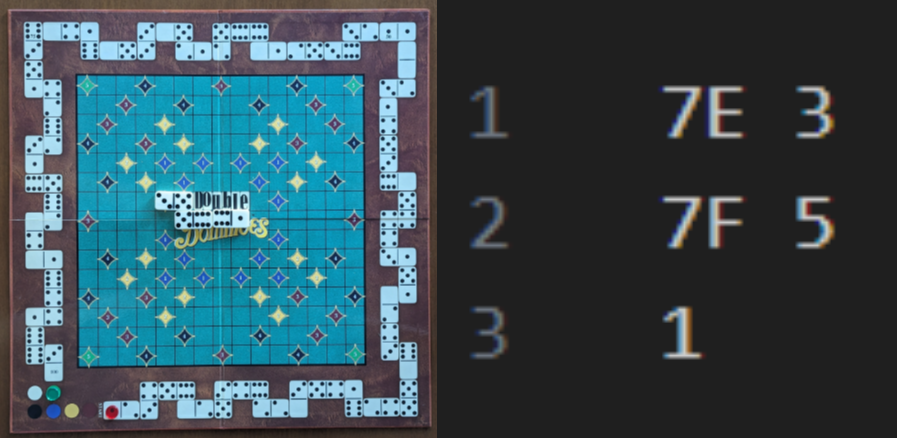
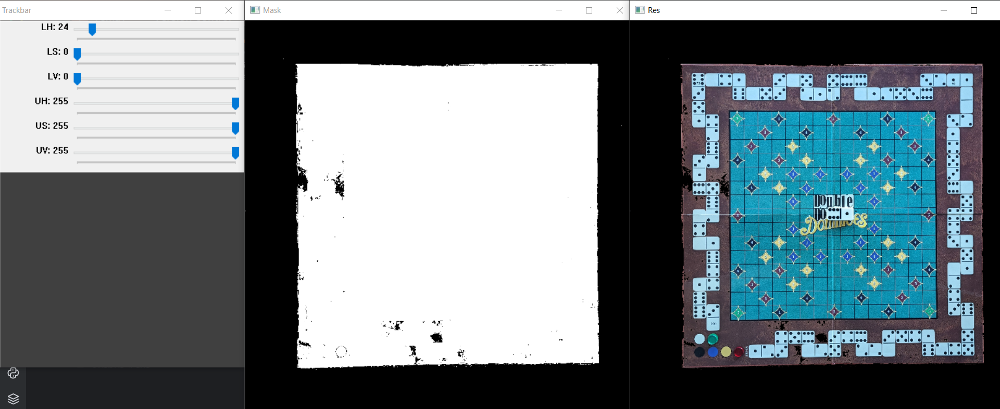
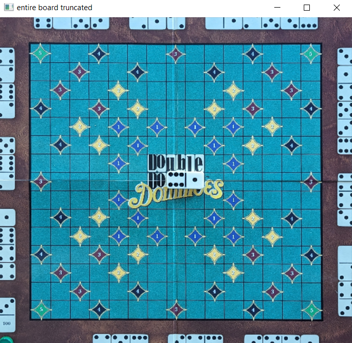
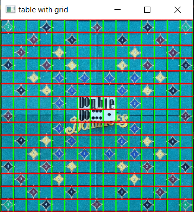
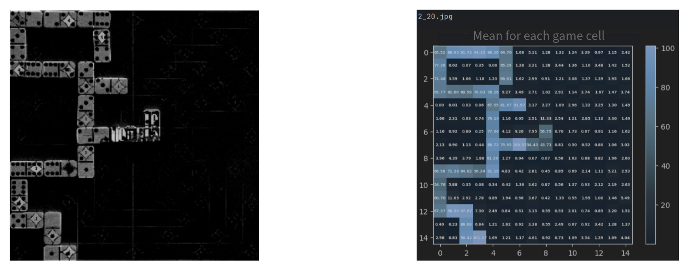

# Double Double Dominoes - Score Calculator

This project focuses on implementing an automatic score calculator for a domino game variant called **Double Double Dominoes (DDD)**. For a more detailed description of the game access [GAME_DESCRIPTION.md](GAME_DESCRIPTION.md).

## Data Description
The dataset consists of images from DDD games at different stages, along with corresponding annotations. The data is divided into three directories inside the [`data`](data) folder:
- **antrenare** (training)
- **testare** (testing)
- **imagini_auxiliare** (auxiliary images)

The **training dataset** consists of images from the first 20 moves of 5 different DDD games. Each image has a corresponding annotation file that contains the following details:
- The position of the domino placed on the board, with positions numbered from left to right and top to bottom. Rows are numbered 1 to 15, and columns are labeled A to O, following official Scrabble annotation rules.
- The numbers on both ends of the domino piece.
- The score earned by the current player in that round.

Additionally, for each game, there is a file indicating which player made the move.

  

For example, in the image below, it can be seen the annotation file along with the corresponding game board image. In the current round, the domino tile containing the numbers 3 and 5 was placed. The annotation file records the position (row and column), the numbers on the tile, and the score.

The **test dataset** includes images from the first 20 moves of 5 different DDD games, along with corresponding player turn files. Instead of providing annotation files, we are required to generate them using our implemented automatic scorer. 

The **auxiliary images** folder contains examples of game boards with different tile arrangements, along with an empty board image to help us understand the problem and generate samples for template matching.

## File Names
The files in the provided datasets are named as follows:

- **game images**: named in the format `i_j.jpg`, where $i \in \lbrace 1, 2, 3, 4, 5 \rbrace$ represents the game number and $j \in \lbrace 01, 02, \ldots, 20 \rbrace$ represents the move number.
- **annotation files**: corresponding to each image, these files are named `i_j.txt`.
- **player turn files**: these files are labeled `i_mutari.txt`, indicating the turns of the players throughout an entire game.

In the folder [`data/evaluare/fisiere_solutie/332_Rincu_Stefania`](data/evaluare/fisiere_solutie/332_Rincu_Stefania), you will find the annotation files generated as solutions after running the automatic solver on the provided test images.

The document [`332_Rincu_Stefania_Tema1_CAVA_Documentatie.pdf`](332_Rincu_Stefania_Tema1_CAVA_Documentatie.pdf) includes the documentation for the project related to the assignment. It details the solution I implemented and the performance results I achieved. The document is written in Romanian, as it was part of a university project. More details about the datasets, game rules, and tasks can be found in the document [`Tema1.pdf`](Tema1.pdf), which outlines the actual homework requirements. This document is also written in Romanian.

## Test Performance
In the [`data/evaluare`](data/evaluare) folder, you will find a file that contains the evaluation code (`cod_evaluare.py`). Once you have implemented the automatic solver, you can test its performance by generating results for the test dataset. Then, within the given script compare the annotation files you created with those in the [`data/evaluare/ground_truth_test`](data/evaluare/ground_truth_test) folder.

## How to run
All tasks are executed using the same script: `main.py`.

I ran the program in PyCharm, and all the folders were included, so the file paths are simplified by just mentioning the necessary files. Inside the main script, I defined the following constants:
- `SOL_FOLDER_PATH`: The path where the solution files are saved.
- `IMGS_FOLDER_PATH`: The path from where the game board images are retrieved.
- `TEMPLATES_FOLDER_PATH`: The path where the templates are saved.
- `AUX_IMAGE_FOLDER_PATH`: The path to the auxiliary empty board image.

If you want to modify the structure of the project, remember to update these paths accordingly.

To install all required libraries, you can find the Anaconda environment file in `dddsolver.yaml`. Simply download it, import it into Anaconda, and select it as the interpreter when running the project. 

Alternatively, if you don't want to use Anaconda, you will need to manually install **numpy** and **opencv**. 

## Solution
In order to implement an automatic solver for a DDD game, in this project I performed the following sub-tasks:
1. Detect the **game board** where the domino tiles are placed (the 15x15 grid). 
2. Identify the **placement of dominoes** on the board after each move.
3. **Recognizesthe numbers** on each placed domino.
4. **Calculate the score** for the game based on the rules, including bonus points for special positions and double dominoes.

The project processes images of the board to extract necessary game data, following a sequence of image preprocessing, contour detection, and template matching for number recognition.

## Step 1 - detect game grid

At this step, I focused on detecting the game square by first extracting the larger board that contains it. In order to find the corners of the board, I implemented a function called `determine_corners`, that looks for the largest contour and saves the top-left and bottom-right points. From these, the other two corners are computed in order complete the square. This function returns a vector with the four sets of corner coordinates.

### Determining the Larger Board
To find the entire board, I converted the image to **HSV space** and set the lower hue limit to 24. This helps eliminate dark brown shades (the table where the board is placed) and creates a mask with black pixels where the board is located.

    

Next, I changed the result to Grayscale. I first applied a **median filter** to reduce noise, then a **Gaussian filter** to blur the image and smooth out details. After that, I used a **sharpening filter** to enhance the details. I then binarized the sharpened image with a **threshold** to highlight the board's edges and used the **Canny operator** to detect edges. Since the edges were very segmented, I applied **dilation** to connect the white pixel areas. Then, I called the `determine_corners` function to find the corners.

### Augmenting the Larger Board
I noticed that there was a scoring track along the edge of the larger board. This could cause errors in detecting the game square, so I trimmed some pixels from the outside.

    

### Determining the Game Grid
To detect the game square, I took the truncated board from the previous step. I applied a **median filter** followed by a **Gaussian filter** to smooth the image. This time, I focused on blue-green shades by limiting the hue range to [30, 134].Then, in order to preprocess the image I followed the same steps as the one presented for the larger board detection, changing some parameters like the threshold. Additionally, I applied another median filter to the dilated image to prevent overlaps with the scoring area. After that, I called the `determine_corners` function again.

### Matrix Simulation
While working on the algorithm, I found it helpful to divide the game board image into a 15x15 matrix. This way, I can identify which cell contains a piece. I resized the game square to 150x150 for this purpose.

    

## Step 2 - identify the position of the placed domino tile

Finding the position of each piece on the game board was the most challenging requirement. To determine where a new piece was placed during a round, I used the difference between the current board and an auxiliary empty board image (found in [`data/aux_img/empty_table.jpg`](data/aux_img/empty_table.jpg)). However, I encountered many false positive identifications due to text present in the middle of the board. Initially, I considered using HSV color space and applying a black mask over the pieces, but this approach needed multiple adjustments for brightness and saturation. 

The solution I implemented uses the auxiliary empty board image as a stable reference. To handle variations in brightness, I added a **linear interpolation** function (`determine_interpolation`) that compares the empty board image with the first image from each new game. This process involves **normalizing the histograms of pixel intensities** from both images, allowing me to adjust the distribution of pixel intensities. As a result, I can apply a **Look-Up Table (LUT)** to future images based on this interpolation. This adjustment ensures that lighting variations do not negatively affect piece detection, leading to more accurate identification of placed pieces on the board.

Next, I take the result obtained from subtracting the auxiliary table from the current game table (after applying the LUT transformation) and apply a median filter. Then, I binarize the image by setting a threshold. After that, I use a **morphological opening operator** to remove foreground pixels and fill in the white spaces where the new piece is located. On the resulted image, I calculate the mean of the values inside each cell on the game board, and if the mean inside one cell exceeds a certain threshold, I consider that a piece was placed there. 

To prevent considering a piece as "just placed" multiple times, I use a 15x15 matrix called `game_table`. This matrix is initialized with all values set to 0 at the start of a new game. After each round, I update the matrix by marking the position where a piece was placed with 1.

    

In the picture above, it can be seen the difference between the game board from [`data/antrenare/2_20.jpg`](data/antrenare/2_20.jpg) and the auxiliary empty board, along with the mean obtained for each cell after all preprocessing steps were applied. 

## Step 3 - determine the numbers on the piece

To recognize the numbers on a domino tile, I first split the piece into two halves to reduce the number of templates needed. Then I selected **17 templates** that cover all possible orientations for the dots inscripted on the tiles. I chose multiple templates for numbers 0, 1, and 2 due to frequent misidentification. The templates can be found in the [`data/templates`](data/templates) folder.

Both the templates and the patches of the domino halves detected in a round underwent the same preprocessing steps. This involved converting the images to HSV color space and narrowing the hue and saturation ranges. By doing this, I preserved areas of lower intensity and kept only the cool tones from the original images.

For the **template matching** step, I used OpenCV’s `matchTemplate()` method to compare each region of the board where a domino is detected with the corresponding templates, identifying the numbers on each domino. I used **correlation** between a patch and a template as the matching metric with `cv.TM_CCOEFF_NORMED`. 

## Step 4 - calculate score
To calculate the score, I maintained a list containing two sublists: one for Player 1's position on the score table and another for Player 2. 

At the end of each round, I pass to function `calculate_score` the list of player positions, the index of the current player, the coordinates of the newly added piece, and the numbers on that piece. I access values from a hardcoded matrix that contains bonus points (`table_points` variable defined at the beggining of the script) corresponding to the specified coordinates and sum them to calculate the received points. If a double piece is added, I multiply the score by 2. 

Next, I check if the current player's last position on the score map matches either of the two numbers on the piece. If so, I add 3 points. If the total points exceed 0, I simulate moving the token on the score table by advancing a "number of score boxes" and update the current player's position by adding the newly calculated position.

Additionally, for the opponent, I check if their last position on the score map corresponds to either of the two numbers on the current piece. If it does, I add 3 points by updating their position vector.

## Functions
- `determine_corners(contours, border)` – returns a list of coordinates for the largest contour from the provided ones
- `detect_entire_board(original_image)` – detects the entire board and returns its matrix; calls the `determine_corners` function
- `extract_DDD_table(original_image)` – extracts the game area and returns it; calls `detect_entire_board` and `determine_corners`
- `determine_interpolation(first_table, aux_table)` – performs interpolation between two images based on pixel intensity and returns a mapping matrix
- `determine_piece_coordinates(just_game_table, aux_table_gray, game_matrix, game_round)` – determines the coordinates of a piece and returns them
- `match_number(patch)` – performs template matching; requires `TEMPLATES_FOLDER_PATH`
- `determine_number_on_piece(just_game_table, piece_edges)` – identifies the number on a piece by calling `match_number`; returns a number
- `calculate_score(players_pos, current_player, coord, nr_on_piece)` – calculates the score
